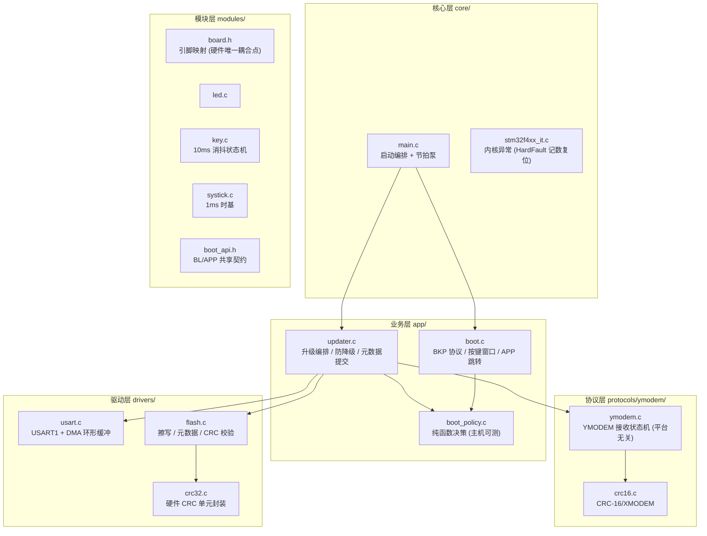
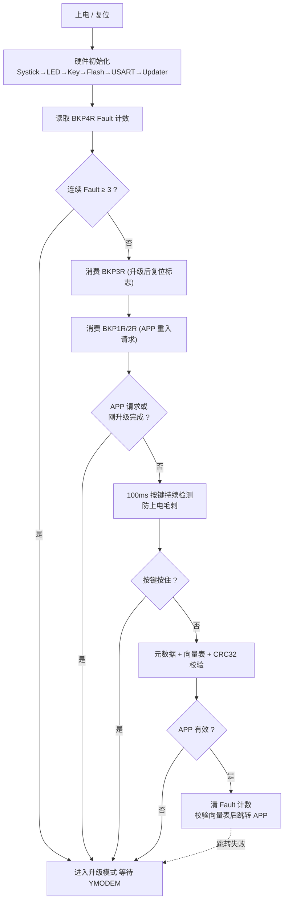
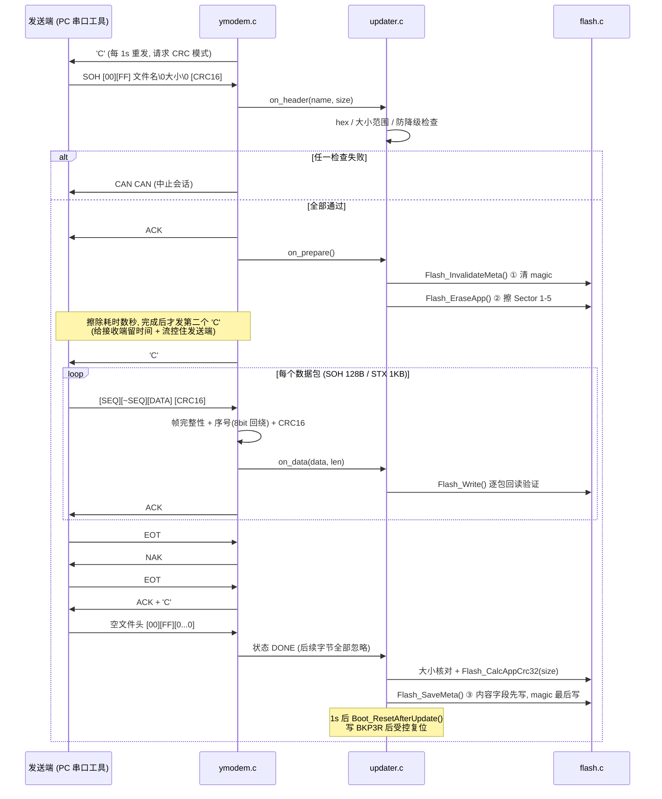
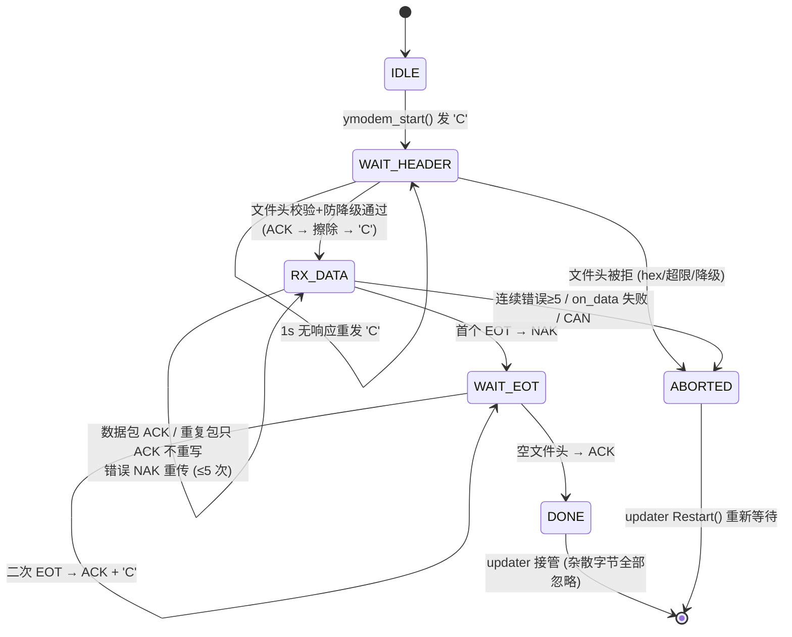

# 架构详解

面向读者的深度架构文档：先建立整体认知，再按层拆解模块职责与关键机制，
最后给出每个设计决策的理由。配合源码阅读效果最佳；概要信息见
[系统设计](系统设计.md)，操作与排错见[升级与排错](升级与排错.md)。

## 1. 总览

本项目是 STM32F411CEU6 的串口 Bootloader：上电后按确定性策略决定
"启动已有 APP"或"进入 YMODEM 升级模式"；升级采用掉电安全的两阶段
元数据提交，任何时刻断电都不会启动未验证的固件。仓库包含两个自包含
工程：`bootloader/`（链接 0x08000000，限 16KB）与 `app/`（链接
0x08004000，LED 演示 + 长按重入升级）。

核心设计原则：

1. **分层解耦**：协议状态机与策略决策不依赖硬件，可在主机上完整单测。
2. **单上下文状态机**：协议超时逻辑全部运行在主循环，中断只做计数，
   从结构上消灭竞态（v3.3 修复，见第 8 节）。
3. **掉电安全**：元数据以 magic 最后写入作为"事务提交点"，配合擦除前
   先失效，保证断电收敛（见第 6.2 节）。
4. **最坏情况不变砖**：所有等待路径都有超时；HardFault 连续复位达到
   上限后停在升级模式等待修复。

## 2. 分层架构与模块职责



依赖方向严格自上而下；`protocols/` 与 `boot_policy.c` 不包含任何硬件
头文件，`tests/` 在主机 gcc 下直接编译它们做全流程测试。APP 工程复用
同源的 `modules/`（led/key/systick/board/bootapi 逐字节一致），通过
`boot_api.h` 与 Bootloader 共享分区表与重入协议。

| 文件 | 职责 | 关键接口 |
|---|---|---|
| `core/main.c` | 硬件初始化、启动决策调用、升级主循环、节拍泵 | `Systick_OnTick` `PumpYmodemTicks` |
| `app/boot.c` | BKP 寄存器读写、按键窗口、跳转与外设清理、Fault 计数 | `Boot_TakeAppRequest` `Boot_JumpToApp` |
| `app/boot_policy.c` | 纯函数：启动决策、防降级判定 | `BootPolicy_Select` `BootPolicy_AllowUpgrade` |
| `app/updater.c` | YMODEM 回调实现：校验、擦除、写入、CRC、元数据提交 | `OnHeader` `OnPrepare` `OnData` `Finalize` |
| `protocols/ymodem/ymodem.c` | 逐字节状态机：组包、校验、重传、超时、中止 | `ymodem_feed` `ymodem_tick` |
| `drivers/flash/flash.c` | 扇区擦除、字节编程+回读、元数据两阶段提交、启动校验 | `Flash_Write` `Flash_SaveMeta` `Flash_IsAppValid` |
| `drivers/usart/usart.c` | 115200-8-N-1，RX 用 DMA2_Stream2 环形缓冲，溢出检测 | `Usart_RxAvailable` `Usart_TakeRxOverflow` |

## 3. Flash 分区与元数据

```text
0x08000000 ┌─────────────────────┐ Sector 0
           │ Bootloader  16KB    │ 只读, 门禁 <16KB (实测 13120B)
0x08004000 ├─────────────────────┤ Sector 1-5 (16K×3 + 64K + 128K)
           │ APP        240KB   │ 擦写区, 末尾预留 128KB 未用
0x08040000 ├─────────────────────┤ Sector 6 (128KB)
           │ Metadata   前 16B  │ fw_meta_t, 每次升级整扇区擦除一次
0x08060000 ├─────────────────────┤ Sector 7 (128KB)
           │ Reserved           │ 预留 (可做双元数据轮换)
0x08080000 └─────────────────────┘
```

元数据结构（16 字节，自然对齐无填充）：

| 偏移 | 字段 | 说明 |
|---|---|---|
| 0 | `magic` | 0x4D455441 "META"，**最后写入 = 提交点** |
| 4 | `size` | 固件字节数 |
| 8 | `crc32` | 整包硬件 CRC32 |
| 12 | `version` | 文件名 `vX.Y` 解析为 `(X<<8)\|Y`，0 表示未知 |
| 14 | `reserved` | — |

CRC32 使用 STM32 硬件 CRC 单元（多项式 0x4C11DB7），按小端整字送入；
尾部不足 4 字节补 0xFF（与擦除态一致）。计算与启动校验使用同一函数，
数值自洽；因字节序处理与逐字节的标准 CRC-32/MPEG-2 数值不同，该值
仅用于设备内部一致性校验，不与外部工具比对。

启动时 `Flash_IsAppValid()` 做三重校验：元数据 magic → APP 向量表
（MSP 落在 SRAM、Reset 向量落在 APP 区且 Thumb 位为 1）→ 全固件
CRC32 重算比对。

## 4. 备份寄存器协议（RTC BKP，跨复位保持）

| 寄存器 | 写入方 | 内容 | 消费方 |
|---|---|---|---|
| BKP1R | APP | 魔数 0xDEADBEEF | Bootloader `Boot_TakeAppRequest` |
| BKP2R | APP | 魔数反码 | 同上（双寄存器抗误触发：随机数据同时匹配正反码概率近似为零） |
| BKP3R | BL 升级完成路径 | "POST" 标志 | 复位后跳过一次按键检测窗口 |
| BKP4R | BL HardFault 处理 | 连续 Fault 复位计数 | 达 3 次后强制停在升级模式 |

读写均遵循"使能 PWREN + DBP → 操作 → 关 DBP"序列；读取语义为
**取出即清除**（一次性），避免残留导致误触发。

## 5. 启动决策流程



三个输入信号的短路求值是刻意的：APP 请求/升级后复位时**跳过**按键窗口
与 APP 校验（同一次 PC13 长按与物理升级键不冲突，且升级请求必然进
升级模式）；按键按住时跳过 APP 校验（用户意图明确）。决策本身集中在
`BootPolicy_Select` 纯函数：APP 请求 > 按键 > APP 无效 > 正常启动，
决策表在主机单测中全覆盖。

## 6. 升级流程

### 6.1 时序总览



### 6.2 掉电安全：断电点分析

不变量：**任何时刻断电，重启后要么运行旧的有效固件，要么进入恢复
模式，绝不运行未验证的固件。**

| 断电时机 | 现场状态 | 重启后行为 |
|---|---|---|
| 接收文件头阶段 | APP 与元数据均未动 | 跳转旧 APP（正常启动） |
| ① 失效元数据之后 | magic 已清（Flash 只能 1→0，写 0 必然清除） | APP 判无效 → 恢复模式 |
| ② 擦除 / 数据写入中 | APP 半成品 + 无元数据 | 同上 |
| ③ 写元数据内容字段中 | magic 仍未写 | 同上 |
| magic 写入之后 | 元数据完整，size/CRC 均来自已验证内容 | 启动校验通过 → 正常启动 |
| 受控复位之后 | BKP3R 在备份域保持 | 跳过按键窗口直接校验启动 |

### 6.3 防降级

`on_header` 阶段旧元数据尚未失效，读取已装版本与文件名解析的 incoming
版本交给 `BootPolicy_AllowUpgrade(app_valid, installed, incoming)`：

| app_valid | installed | incoming | 结果 |
|---|---|---|---|
| 1 | v1.2 | v1.3 / v1.2 | 允许（升级或重刷同版） |
| 1 | v1.2 | v1.1 | **拒绝**（CAN CAN 中止并提示） |
| 0（recovery） | 任意 | 任意 | 允许（逃生门：旧版本可救砖） |
| 1 | 任意 | 0（文件名无 vX.Y） | 允许（不误拦无法解析版本的固件） |

### 6.4 错误恢复路径

| 异常 | 检测点 | 处理 |
|---|---|---|
| 包 CRC/序号错 | 帧校验 | NAK 请求重传，连续 5 次错误后 CAN CAN 中止 |
| 数据包等待超时 | 3s 无包 | 重发上次响应（ACK/NAK/C），5 次后中止 |
| **半包滞留**（发送端死机/拔线） | 1s 帧内超时 | 丢弃半包 + NAK；这是 v3.3 修复的永久挂死路径 |
| 包内 CAN CAN | 校验失败的包扫描原始字节流 | 立即中止（正常数据包中的 0x18 0x18 因 CRC 通过不受影响） |
| RX 环形缓冲溢出 | 读侧比较写入跨度与剩余空间 | 丢弃缓冲、重启接收会话 |
| 升级窗口超时（防御路径） | updater 状态机 | APP 有效则跳转，否则系统复位 |
| 任意中止/失败 | `Restart()` | 回到等待状态，无需断电重试 |

## 7. YMODEM 状态机



协议细节（多数为兼容性关键点）：

- **序号 8-bit 回绕**：第 256 个数据包 seq=0，按数据包处理（v3.3 修复；
  修复前 SOH 传输超过 255 包必然失败）。
- **EOT 双握手**：首个 EOT 回 NAK、二次 EOT 回 ACK+'C' 请求结束空包，
  符合标准 YMODEM；同时兼容"单 EOT 直接空包"的变体发送器。
- **文件头解析防护**：文件名 ≥63 字节未终止整包拒绝（截断会导致大小
  字段从文件名中间误解析）；大小数字串最多取 9 位防溢出回绕。
- **传输结束后**：DONE 状态忽略一切字节，避免 1s 跳转等待窗口内的
  杂散数据组包产生噪声应答。

## 8. 并发与上下文设计（v3.3 核心修复）

```text
┌─ SysTick 中断 (1ms) ────────────────────────────┐
│  Led_Tick()  Key_Tick()  s_ymodem_ticks++       │   ← 只做轻量、确定性操作
└─────────────────────────────────────────────────┘
┌─ 主循环 while(1) ───────────────────────────────┐
│  Updater_Process():                             │
│    溢出检测 → 逐字节 ymodem_feed() → 状态机推进  │   ← 协议状态机
│  PumpYmodemTicks():                             │      单上下文串行访问
│    临界区取走累积节拍 → ymodem_tick() × N        │      (无锁、无 volatile 纠缠)
└─────────────────────────────────────────────────┘
```

v3.2 及之前 `ymodem_tick()` 直接运行在 SysTick 中断里，与主循环的
`ymodem_feed()` 并发读写同一组状态变量（无 volatile、无临界区），
超时路径还会在中断里调用 `on_abort` → printf——microlib printf
非重入，且中断内忙等发送会拉长中断周期。平时"靠巧合正确"（一个
`s_pkt_idx != 0` 的守卫挡住了大部分窗口），但存在真实的 TOCTOU 竞态。
v3.3 将协议逻辑全部移入主循环：中断只递增节拍计数，主循环用
`__disable_irq()` 临界区批量取走计数。这个"单上下文状态机"契约已写进
`ymodem.h` 头文件注释。

擦除 Flash 期间代码执行停顿（同 Bank 取指阻塞），SysTick 节拍实际
暂停，协议时基随之中停——因此数秒级的擦除不会挤占数据包超时窗口。

## 9. APP 跳转（`Boot_JumpToApp`）

跳转前的完整清理序列，目标是把芯片恢复到接近复位默认态：

1. **先校验后清理**：MSP 必须落在 0x20000000~0x20020000、Reset 向量
   必须落在 APP 区且 bit0=1；校验失败直接 return（不留下已关闭的外设）。
2. `Usart_WaitTxIdle()` 等日志发完 → `__disable_irq()`。
3. 关闭 USART/DMA，**GPIOA、GPIOC 整端口复位**（`RCC_DeInit` 不复位
   GPIO 配置，残留的 AF/输出态可能干扰 APP）。
4. SysTick 三寄存器清零；NVIC 8 组 ICER/ICPR 全清（去使能 + 清挂起）。
5. `RCC_DeInit()` 复位时钟树，**再显式清零 AHB1/APB1/APB2 使能位**
   （`RCC_DeInit` 同样不清这些位）。
6. `SCB->VTOR = 0x08004000` → `__set_MSP()` → `__set_CONTROL(0)`
   （清 PSP 使用标志，很多实现遗漏）→ `__enable_irq()` → `__DSB/ISB`
   → 函数指针跳转。

APP 侧配合：`main` 首行再设一次 VTOR（双保险，支持直接烧 APP 调试）；
`SystemInit` 重建 12MHz HSE → 96MHz 时钟树。

## 10. APP 侧与重入升级

演示 APP 主循环做三件事：VTOR 设置、LED 心跳（50ms 翻转）、
**长按 PC13 1.5s 触发 `Boot_RequestBootloader()`**——写入 BKP1R/2R
魔数+反码后 `NVIC_SystemReset()`，Bootloader 侧消费请求进入升级。
短按不动作防误触；长按期间 LED 转为 100ms 快闪提示。

`boot_api.h` 是双工程的唯一契约文件（各持一份拷贝，需人工同步）：
定义分区地址/大小宏（`flash_config.h` 引用它保证两工程分区一致）、
BL 版本号、重入 API。业务固件可在任意入口（串口命令、OTA 判定、
错误处理）调用该 API。

## 11. 工程结构与验证体系

- **双工程自包含**：`bootloader/` 与 `app/` 各带全量 `libraries/`，
  互不依赖，可独立打开编译（Keil `.uvprojx` 或 VSCode EIDE）。
- **同步点**：新增源文件/头文件目录需同步 5 处——两个 `.eide/eide.yml`、
  两个 `.uvprojx`、`tools/build_check.sh`（AGENTS.md 有详细说明）。
- **主机单测**（Linux gcc / WSL，无硬件依赖）：
  - `tests/ymodem`：15 个用例，手写模拟发送端驱动完整协议交互——
    多包传输、128B/1K 包、CRC 错误恢复、重复包、超时中止、seq 回绕
    （256 包×128B）、帧内超时恢复、包内 CAN、各种拒绝路径。
  - `tests/boot_policy`：13 条断言，覆盖启动决策表全组合 + 防降级
    决策表（含数值比较、逃生门、版本未知放行）。
- **全量验证**：`bash tools/build_check.sh`（WSL 调 Windows AC5
  编译两工程全部源文件 + 链接 + 体积门禁 <16KB）。

## 12. 关键设计决策与取舍

| # | 决策 | 备选方案 | 理由（代价已接受） |
|---|---|---|---|
| 1 | 升级成功后**复位**而非直接跳转 | 跳转 | 环境绝对干净（时钟/NVIC/外设全复位态），代价一次约百毫秒重启 |
| 2 | **不用 IWDG**，软件超时封死全部挂死路径 | 看门狗 | IWDG 运行时不可关闭、跨复位仍有效，会把"必须持续喂狗"义务传染给 APP，破坏跳转契约；已知所有等待路径均有超时兜底 |
| 3 | 元数据 magic **最后写入**（两阶段提交） | 校验通过即有效 | 断电安全的提交点语义，任何时刻断电收敛到"无效→恢复模式" |
| 4 | 擦 APP 前**先失效元数据** | 擦完再写 | 擦写中途断电时 APP 与元数据同时失效，不会出现"元数据有效但固件半写" |
| 5 | 防降级版本取自**文件名** | 固件内嵌版本段 | 不侵入 APP 链接脚本与构建；局限：改名失真，此时版本为 0 自动放行（不误拦） |
| 6 | 策略层**纯函数** + 协议层**回调解耦** | 直接写在 main/驱动里 | 决策表与协议全流程可在主机单测；答辩可演示 |
| 7 | 元数据独占 Sector 6（128KB 存 16B） | 双扇区轮换备份 | F411 扇区不对称；元数据每次升级才擦写一次，10K 擦写寿命下足够；Sector 7 已预留可升级为轮换方案 |
| 8 | 硬件 CRC32 单元（小端整字） | 软件查表 CRC | 快、省 ROM；字节序与标准 MPEG-2 数值不同，但收发同源自洽（仅内部使用） |
| 9 | 协议控制字节/日志**阻塞发送** | DMA TX | 升级场景吞吐要求低；阻塞发送天然保证应答时序，简化并发 |

## 13. 量化指标

| 指标 | 数值 |
|---|---|
| Bootloader 体积 | 13120 B / 16384 B 门禁（占 80%） |
| 演示 APP 体积 | 2176 B / 240KB 分区 |
| RX 环形缓冲 | 2048 B（DMA 循环模式，溢出可检测） |
| 超时参数 | 'C' 重发 1s；数据包超时 3s；帧内超时 1s；连续错误上限 5 |
| 按键参数 | 复位升级键窗口 100ms（全程按住）；APP 长按重入 1.5s |
| HardFault 保护 | 连续 3 次复位后停在升级模式 |
| 升级吞吐（理论） | 115200-8-N-1 下 240KB 传输约 22s + 擦除数秒 |
| 单元测试 | YMODEM 15 用例 + 启动策略 13 断言，主机全绿 |
| 校验层级 | 包级 CRC16 → 逐包 Flash 回读 → 整包 CRC32 → 启动时再校验 |
